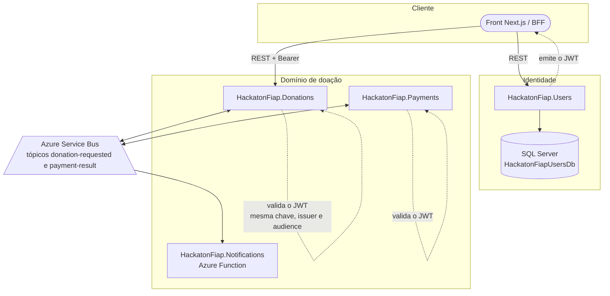
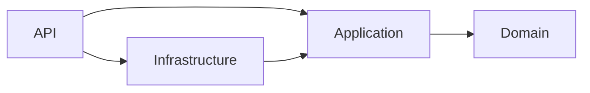
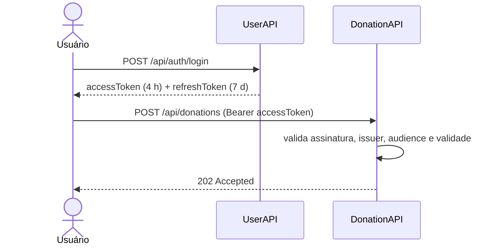

# Arquitetura — HackatonFiap.Users (UserAPI)

Detalhamento das camadas, decisões e pontos de integração da UserAPI, o microsserviço de identidade e acesso da plataforma **Conexão Solidária**. A visão geral do serviço está no [README](../README.md); a topologia completa da plataforma está no repositório [orchestration](https://github.com/GabrielVeridico/hackaton-fiap-orchestration#ecossistema).

## Onde a UserAPI se encaixa

A plataforma tem quatro serviços de backend, cada um com o próprio banco. A comunicação entre eles é **assíncrona**, por tópicos do Azure Service Bus. A UserAPI é a exceção: ela não participa da mensageria — sua integração com os demais é o **token JWT**, validado localmente por cada serviço.

Consequências dessa escolha:

- Nenhum serviço chama a UserAPI em runtime para autorizar uma requisição. Uma indisponibilidade aqui impede novos logins, mas não derruba a saga de doação nem a página de transparência.
- Os eventos de integração carregam os dados do doador (`DonorId`, `DonorEmail`, `DonorName`) capturados no momento da intenção de doação. A NotificationFunction notifica sem consultar este serviço.

## Camadas

A UserAPI segue Clean Architecture com quatro projetos. A dependência aponta sempre para dentro.

| Projeto | Responsabilidade | Depende de |
|---------|------------------|------------|
| `HackatonFiap.Users.Domain` | Entidades `User` e `RefreshToken`, value objects `Document` e `Password`, enums `UserRole` e `PersonType`, `Result`/`Result<T>`/`Error`. Sem dependência externa. | — |
| `HackatonFiap.Users.Application` | Comandos, queries, handlers, DTOs e as interfaces de saída (`IUserRepository`, `IRefreshTokenRepository`, `IPasswordHasher`, `IJwtTokenGenerator`, `IAuditService`). | Domain |
| `HackatonFiap.Users.Infrastructure` | EF Core (`ApplicationDbContext`, configurations, repositórios, migrations), BCrypt, geração de JWT e de refresh token, auditoria. | Application |
| `HackatonFiap.Users.API` | Controllers, middlewares, health checks, OpenTelemetry, composição da DI em `Program.cs`. | Application + Infrastructure |

### Domain

`User` tem setters privados e é construída por métodos de fábrica (`RegisterDonor`, `CreateByAdmin`, `CreateOwner`). As transições de estado — `ChangeRole`, `Deactivate`, `Reactivate`, `UpdateProfile`, `ChangePassword` — são métodos da própria entidade, não atribuições feitas de fora.

`Document` valida CPF (`PersonType.Individual`) e CNPJ (`PersonType.Company`) na criação. Um documento inválido produz um `Result` de falha, não uma exceção. `Password` guarda apenas o hash e expõe `IsValid`, que exige no mínimo 8 caracteres com letra, número e símbolo.

**Nenhum handler lança exceção para sinalizar erro de negócio.** Todos retornam `Result<T>` com um `Error` que carrega código e descrição; o controller traduz o código em status HTTP.

### Application

Um par comando/handler por caso de uso, em pastas com o nome do caso de uso:

| Grupo | Casos de uso |
|-------|--------------|
| Autenticação | `AuthenticateUser`, `RegisterDonor`, `RefreshTokenFlow`, `Logout` |
| Gestão | `CreateUser`, `UpdateUser`, `ChangeUserRole`, `DeactivateUser`, `ReactivateUser` |
| Autoatendimento | `UpdateMyProfile`, `ResetMyPassword` |
| Queries | `GetProfile`, `GetUserById`, `ListUsers` |

Não há MediatR. Os handlers são registrados como `Scoped` e injetados direto no controller. Para o tamanho deste serviço, o pipeline explícito é mais fácil de ler e de testar do que a indireção de um mediator.

### Infrastructure

- **Persistência** — `ApplicationDbContext` carrega as configurations por assembly. As migrations são aplicadas no startup (`db.Database.Migrate()`).
- **Senha** — `BcryptPasswordHasher`. O hash nunca sai da camada de infraestrutura.
- **Token de acesso** — `JwtTokenGenerator`, HMAC-SHA256, validade de 4 horas, claims `sub`, `email`, papel e `isOwner`. Recusa qualquer chave com menos de 32 bytes; não existe chave de fallback no código.
- **Refresh token** — `RefreshTokenService` gera 32 bytes aleatórios e persiste apenas o **SHA-256** do valor. O token em claro só existe na resposta HTTP.
- **Auditoria** — `AuditService` grava na tabela `AuditEvents` o antes e o depois em JSON, junto com `CorrelationId`, `TraceId` e o autor da ação.

### API

- `CorrelationMiddleware` — lê `x-correlation-id` do request ou gera um novo, e devolve o mesmo valor no response. O identificador acompanha os logs e os registros de auditoria.
- `RequestResponseLoggingMiddleware` — loga corpo de requisição e resposta com máscara sobre `password`, `senha`, `token`, `secret`, `accessToken` e `refreshToken`.
- Health checks — `/health` (liveness, sem dependência) e `/ready` (readiness, com `AddDbContextCheck`).
- Documentação interativa em `/scalar/v1`, sobre o documento OpenAPI em `/swagger/v1/swagger.json`.

## Segurança

### Emissão e validação do token

Emissor e público são compartilhados por todo o ecossistema (`conexaosolidaria.local` e `conexaosolidaria.clients`, por padrão). A chave de assinatura é a mesma nas três APIs — UserAPI, DonationAPI e PaymentAPI — e vem do Azure Key Vault em produção. A NotificationFunction não expõe HTTP nem valida token: ela só consome mensagens do Service Bus.

### Rotação e detecção de reuso do refresh token

Cada `POST /api/auth/refresh` revoga o token apresentado e emite um par novo, registrando no token antigo qual o substituiu. Se um token **já revogado** for apresentado de novo — sinal de que alguém interceptou a cadeia — o serviço revoga **todos** os refresh tokens do usuário e devolve 401.

### Modelo de papéis

| Papel | Pode |
|-------|------|
| `Doador` | Autocadastrar-se, gerenciar o próprio perfil e a própria senha, doar |
| `GestorONG` | Tudo do doador, mais criar, editar, listar, desativar e reativar usuários |
| `GestorONG` com `isOwner` | Tudo do gestor, mais trocar o papel de outros usuários |

O Owner é semeado no startup quando a base não tem nenhum. Ele não pode ter o papel trocado nem ser desativado — as tentativas retornam 403 com o código `User.OwnerImmutable`.

O `[Authorize(Roles = "GestorONG")]` faz o primeiro corte no pipeline do ASP.NET Core; a exigência de `isOwner` é verificada dentro do handler, porque é uma regra de negócio e não um requisito de transporte.

## Observabilidade

| Sinal | Implementação |
|-------|---------------|
| Logs | Serilog estruturado, enriquecido com `ServiceName`, `MachineName` e `ThreadId`. Sink de console sempre; Application Insights quando a connection string está configurada. |
| Traces | OpenTelemetry com instrumentação de ASP.NET Core, HttpClient e EF Core. |
| Métricas | OpenTelemetry exportado em `/metrics` no formato Prometheus. Contadores próprios: `users_logins_total` e `users_registrations_total`, além das métricas de runtime e de requisição. |
| Correlação | `x-correlation-id` propagado no request, no response, nos logs e nos registros de auditoria. |
| Trilha de auditoria | Tabela `AuditEvents` com o antes e o depois de cada alteração de usuário. |

## Testes

Os 57 casos de teste (xUnit + NSubstitute + FluentAssertions) cobrem três frentes:

| Frente | O que verifica |
|--------|----------------|
| Domínio | Validação de CPF e CNPJ, invariantes de `User`, regras de `Password`, ciclo de vida do `RefreshToken` |
| Handlers de comando | Autenticação, autocadastro, rotação e reuso de refresh token, logout, e as regras de gestão de usuários (incluindo a imutabilidade do Owner) |
| Queries | Leitura de perfil |

Todos os handlers são exercitados contra interfaces mockadas. Não há banco em memória: o objetivo é testar a regra, não o EF Core.
